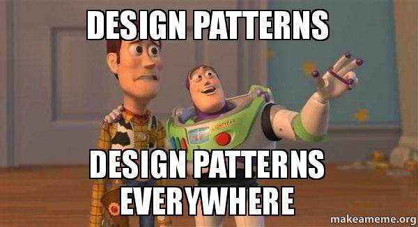

 
 
## I Don't Know What Is Design Pattern, but I own A Restaurant  
  
I own a restaurant located at Central-Smith street (not Computer Science). After a year-long brainstorming, I have decided to name my restaurant “Steak Explore” (not Software Engineering). I am a chef, as I only know a little about Italian cuisine. I hire several fabulous chefs, each of them has strong cooking skills. We discuss the menu together and end up adding many delicious dishes to our menu. To have food prepared in a reasonable time, I require them to strictly follow the recipe for each dish and do not customize the food. I also hire several young servers to handle ordering with the customers, as it could be very ineffective to let the chefs do the serving job and keep moving back and forth. The servers must be capable of communicating with the customers as well as taking their orders correctly. They write down the order for each table and send it to the kitchen. Once the dishes are ready, they should respond to the pick-up window quickly and hand over the dishes to the corresponding table. This is a very common process to run a restaurant but very useful. I learn the strategy from many typical cases and apply it to my business operation, like most other restaurant owners would do. My friend Simon is a great software developer, he tells me that this is known as the **Model-View-Controller** design pattern in the Software Development field. My chefs work as the “Model” since they can respond to the order by using the written meal recipes. My servers perform the functionality the “Controller'' would achieve because they are the ones interacting with both customers in front and the chefs in the back by sending data and updating the table status. Simon says, without the servers, the customers could not place orders by themselves or talk to the kitchen directly but they are accessible to the well-design menu.    
	
That’s interesting and sounds helpful in my business management. I want to know more about the design pattern in software engineering, so I buy Simon a coffee and start to tell him my daily routine. To earn a reputation for my restaurant, I select the best ingredients for my food. Every morning, I bring the shopping list with me and drive to the farm market to purchase the fresh ingredients. The market’s owner, David, is my business partner. He is talented in agriculture and livestock farming. I don’t know how to grow these products, but all I need is just to select and buy what I want. I don’t worry about how to grow the superior cabbages, bell peppers, onions, or carrots as David will be responsible for this. Simon laughs and shows me that this is the circumstance where **Factory Pattern** is established. 

Recently I came up with a promotion plan, which is to offer combos to the customers. This is easy to achieve since Instead of creating new dishes, I just need to combine some of the popular items in different ways and give them a sweet price. Each combo contains an appetizer, a meal, a dessert and a drink. This low-cost strategy is successful and the combos rapidly became the top sellers of my restaurant. Simon also approves of my idea and tells me that I have made good use of the **Builder Pattern**. 

It has been over half a year since I last met Simon. Things always happen. My family and I have experienced a tough time over the last few months and I have run out of my budget. I am unable to maintain my business anymore and in great demand of money. Simon heard about my difficulty and called me out for a coffee today. Now we sit down and continue my story. In order to maximize my business’s market value, I asked one of my friends for help, Elvin, a professional business broker who knows a chain of business buyers. He helped me collect the information about my restaurant and concluded the present status of it. In the next few days, he will announce the buyers who are interested in buying my business and they will keep in touch with the updates. I don’t know any of these buyers, either do they. But Elvin will be the reliable intermediary. Simons says he really feels sorry, and just let me know that this is a typical case of **Observer Pattern** implementation. God, who would care about this at this time! 

## "UI Frameworks" and UI Frameworks  

As a student, I am exposed to many formulas when solving math or physics problems. Why use these formulas, which might be derived from many other equations? For instance, We apply the x-y coordinate plane or Trigonometry functions to many similar related problems to quickly find a routine to the result. We can just use a one-step formula and simply plug in different given values. Do you still remember how struggling you were when learning these new concepts? And how useful do you find these classic problem-solving techniques are for now? Whenever you develop your own systematic way to solve a bunch of similar problems in a short time, you are applying “UI Frameworks” to life.   

“UI Frameworks” are common in other jobs as well. You may be familiar with the different template layouts created in google slide to help the users to prepare their presentation in a short time but still with a nice look. You may like to save some drawing pieces you created for the next use. Before posting a photo to your social media, you may open it in your camera to do some editing, such as applying a fixed filter, rather than modify the raw parameter setting. To my understanding, if I say “UI Frameworks” in a more general way, I suggest that “UI Frameworks” work like a powerful template, a systematic structure helpful in reaching the goal, a problem-solving method we potentially use everyday. 

## My first try with Semantic UI

Semantic UI is the only Framework I am introduced to so far, either have I got into it too much or have learned other framework languages and thus I am unable to compare Semantic with another. Despite my limited knowledge of UI Frameworks, I was truly surprised when I could turn a plain, blank or boring canvas into a mastering-look site simply with Semantic UI. It provides multiple pieces of grouping codes, functioning in the creation of components which I’ve found in some other well-built webpages. Before knowing Semantic UI, I had never thought that I could rebuild a single webpage with just a few codes. Elements like icons, dropdowns make the page clear and professional, and Classes such as grid, menus with variations, types defined indicate a straightforward understanding of what the classes can do. With raw HTML and CSS, it probably takes a large amount of time to create even a small section of a webpage. However, with a very basic knowledge of web page design, learning Semantic UI is not easy for me. I have been struggling in nesting grids, rows and columns, content alignment. But what interests me is, when searching for a useful class to be implemented in my WOD, I look through the Semantic UI document and have found out there are numerous ways to change the outlook of a component by easily adding nature words. Getting used to UI Frameworks may have been sort of painful and frustrating at first, but its effectiveness and the practicality in the creation of a well-organized beautiful page makes it worthwhile. 

