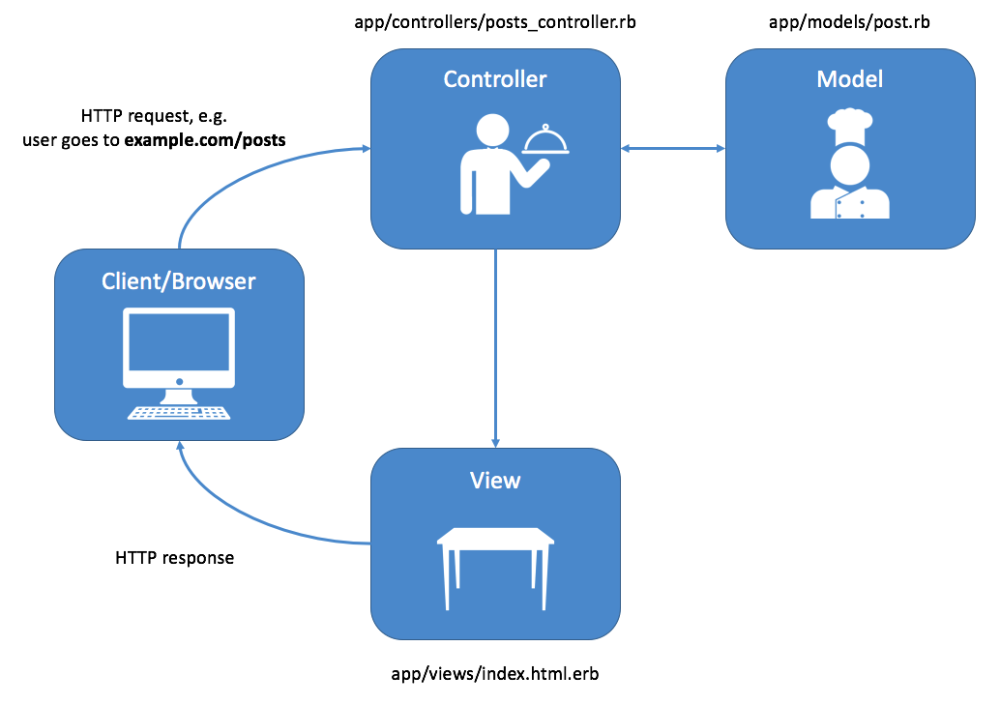
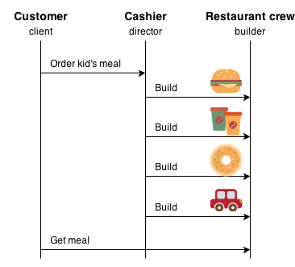

## I Don't Know What Is Design Pattern, but I own A Restaurant  

I own a restaurant located at Central-Smith street (not Computer Science). After a year-long brainstorming, I have decided to name my restaurant “Steak Explore” (not Software Engineering). I am a chef, as I only know a little about Italian cuisine. I hire several fabulous chefs, each of them has strong cooking skills. We discuss the menu together and end up adding many delicious dishes to our menu. To have food prepared in a reasonable time, I require them to strictly follow the recipe for each dish and do not customize the food. I also hire several young servers to handle ordering with the customers, as it could be very ineffective to let the chefs do the serving job and keep moving back and forth. The servers must be capable of communicating with the customers as well as taking their orders correctly. They write down the order for each table and send it to the kitchen. Once the dishes are ready, they should respond to the pick-up window quickly and hand over the dishes to the corresponding table. This is a very common process to run a restaurant but very useful. I learn the strategy from many typical cases and apply it to my business operation, like most other restaurant owners would do. My friend Simon is a great software developer, he tells me that this is known as the **Model-View-Controller** design pattern in the Software Development field. My chefs work as the “Model” since they can respond to the order by using the written meal recipes. My servers perform the functionality the “Controller'' would achieve because they are the ones interacting with both customers in front and the chefs in the back by sending data and updating the table status. Simon says, without the servers, the customers could not place orders by themselves or talk to the kitchen directly but they are accessible to the well-design menu.   

 
 
	
That’s interesting and sounds helpful in my business management. I want to know more about the design pattern in software engineering, so I buy Simon a coffee and start to tell him my daily routine. To earn a reputation for my restaurant, I select the best ingredients for my food. Every morning, I bring the shopping list with me and drive to the farm market to purchase the fresh ingredients. The market’s owner, David, is my business partner. He is talented in agriculture and livestock farming. I don’t know how to grow these products, but all I need is just to select and buy what I want. I don’t worry about how to grow the superior cabbages, bell peppers, onions, or carrots as David will be responsible for this. Simon laughs and shows me that this is the circumstance where **Factory Pattern** is established. 

Recently I came up with a promotion plan, which is to offer combos to the customers. This is easy to achieve since Instead of creating new dishes, I just need to combine some of the popular items in different ways and give them a sweet price. Each combo contains an appetizer, a meal, a dessert and a drink. This low-cost strategy is successful and the combos rapidly became the top sellers of my restaurant. Simon also approves of my idea and tells me that I have made good use of the **Builder Pattern**. 

 

It has been over half a year since I last met Simon. Things always happen. My family and I have experienced a tough time over the last few months and I have run out of my budget. I am unable to maintain my business anymore and in great demand of money. Simon heard about my difficulty and called me out for a coffee today. Now we sit down and continue my story. In order to maximize my business’s market value, I asked one of my friends for help, Elvin, a professional business broker who knows a chain of business buyers. He helped me collect the information about my restaurant and concluded the present status of it. In the next few days, he will announce the buyers who are interested in buying my business and they will keep in touch with the updates. I don’t know any of these buyers, either do they. But Elvin will be the reliable intermediary. Simons says he really feels sorry, and just let me know that this is a typical case of **Observer Pattern** implementation. God, who would care about this at this time! 

## Just For Fun: I Probably Know What Is Design Pattern, but I Don’t own A Restaurant   

Dear readers, as you can see, above is just a made-up story for fun. Upon my understanding, the existence of a design pattern is to avoid unnecessary repeated work while still providing an organized and formatted structure for building code. The usage of design patterns is not only limited to software development but also applies to business, architecture, and industry, so on and so forth. Design patterns are obtained by trial and error by numerous software developers over quite a substantial period of time, serving as a solution template to commonly occurring problems, saving every programmer from rebuilding from scratch.

## Typical Design Patterns In My Codes

- [x] **Model-View-Controller**

This is probably one of the most design patterns found in my 314 final project, which is a web application designed for manoa students and staff to look for food that is available at the campus.  The ‘Model’ part of this design pattern is our database, containing vendor data, user data and food data. The “View” is what the app visitors have access to. They can use the functionality of the app by simply clicking on the functional buttons. Once the users interact with the “View”, it is noticed by the “Controller”. If we take the sign-in part as an example, the text field that allows the entry of username and password is “View”; the submit button works as the controllers as it notices the status change of the “View” and notices the database to find out if the entry exists in the database. “Controllers” control whether the user home page is rendered or the error page is rendered. If there is no “View”, the users won’t be able to see and interact with anything; if there is no “Controller”, and the submit button won’t do its job; and If “Model” doesn’t exist, it is not making sense for the users to enter the username and password.   

- [x] **singleton pattern && Observer Pattern**
 
Some other patterns are also implemented in our code. One is the initialization of collection. Once a collection is created using a scheme, it is exported once and imported by other pages and components. I believe that is how the **singleton pattern** works here. **Observer Pattern** is helpful The vendor collection is subscribed by the all-vendors page and my-vendor page. Once a new vendor is inserted in the database or an existing vendor has its information updated, the pages that subscribe to this publication would also notice those changes and display the right view.
 

