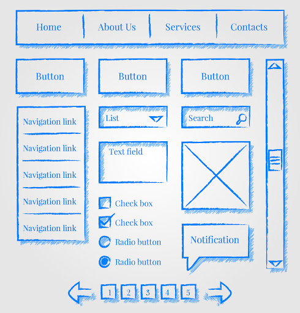

 
  
  
One can encounter many similar problems in their lives, and then develop their own ways to solve the problems effectively. By applying the same or similar strategies, people can save a lot of time instead of starting completely from scratch. In the aspect of web designing, UI Frameworks are structures which a programmer can use to quickly build up a good-looking website as they contain a number of components, styles, menus, etc. Although they can be complicated in some ways, the time spent learning UI Frameworks is worthwhile. Rather than a tool, UI Frameworks are more like a shortcut, or a problem-solving pattern. In fact, we can find many “UI Frameworks” in daily life and work. Examples are various.

## "UI Frameworks" and UI Frameworks  

As a student, I am exposed to many formulas when solving math or physics problems. Why use these formulas, which might be derived from many other equations? For instance, We apply the x-y coordinate plane or Trigonometry functions to many similar related problems to quickly find a routine to the result. We can just use a one-step formula and simply plug in different given values. Do you still remember how struggling you were when learning these new concepts? And how useful do you find these classic problem-solving techniques are for now? Whenever you develop your own systematic way to solve a bunch of similar problems in a short time, you are applying “UI Frameworks” to life.   

“UI Frameworks” are common in other jobs as well. You may be familiar with the different template layouts created in google slide to help the users to prepare their presentation in a short time but still with a nice look. You may like to save some drawing pieces you created for the next use. Before posting a photo to your social media, you may open it in your camera to do some editing, such as applying a fixed filter, rather than modify the raw parameter setting. To my understanding, if I say “UI Frameworks” in a more general way, I suggest that “UI Frameworks” work like a powerful template, a systematic structure helpful in reaching the goal, a problem-solving method we potentially use everyday. 

## My first try with Semantic UI

Semantic UI is the only Framework I am introduced to so far, either have I got into it too much or have learned other framework languages and thus I am unable to compare Semantic with another. Despite my limited knowledge of UI Frameworks, I was truly surprised when I could turn a plain, blank or boring canvas into a mastering-look site simply with Semantic UI. It provides multiple pieces of grouping codes, functioning in the creation of components which I’ve found in some other well-built webpages. Before knowing Semantic UI, I had never thought that I could rebuild a single webpage with just a few codes. Elements like icons, dropdowns make the page clear and professional, and Classes such as grid, menus with variations, types defined indicate a straightforward understanding of what the classes can do. With raw HTML and CSS, it probably takes a large amount of time to create even a small section of a webpage. However, with a very basic knowledge of web page design, learning Semantic UI is not easy for me. I have been struggling in nesting grids, rows and columns, content alignment. But what interests me is, when searching for a useful class to be implemented in my WOD, I look through the Semantic UI document and have found out there are numerous ways to change the outlook of a component by easily adding nature words. Getting used to UI Frameworks may have been sort of painful and frustrating at first, but its effectiveness and the practicality in the creation of a well-organized beautiful page makes it worthwhile. 

