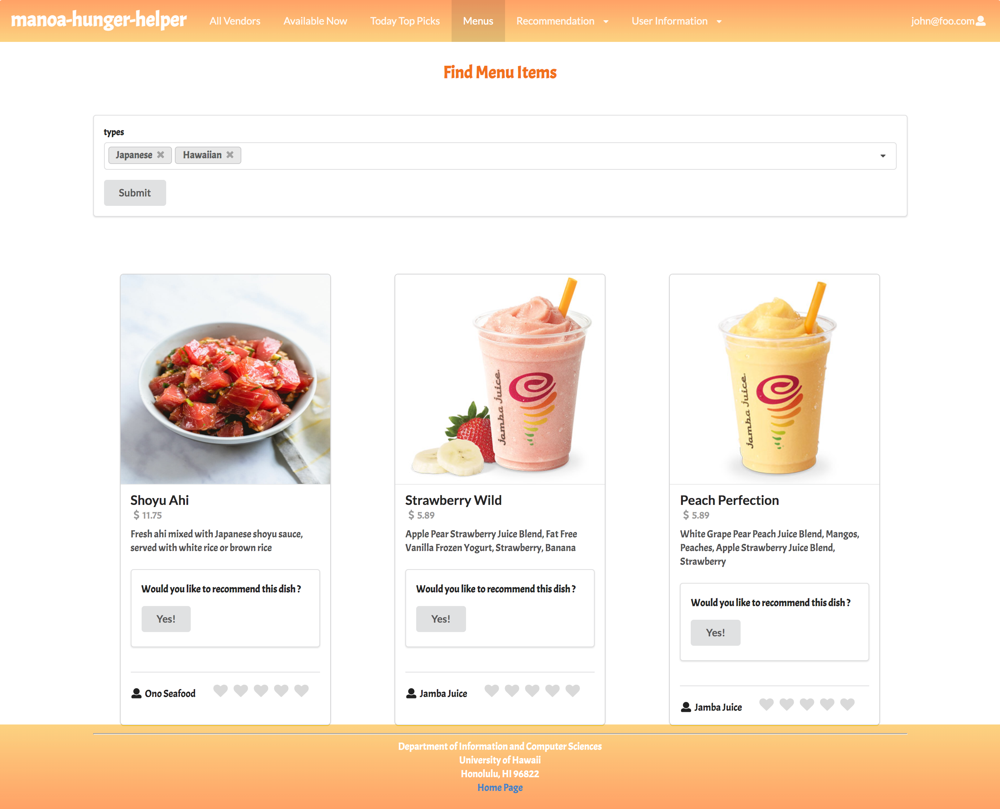
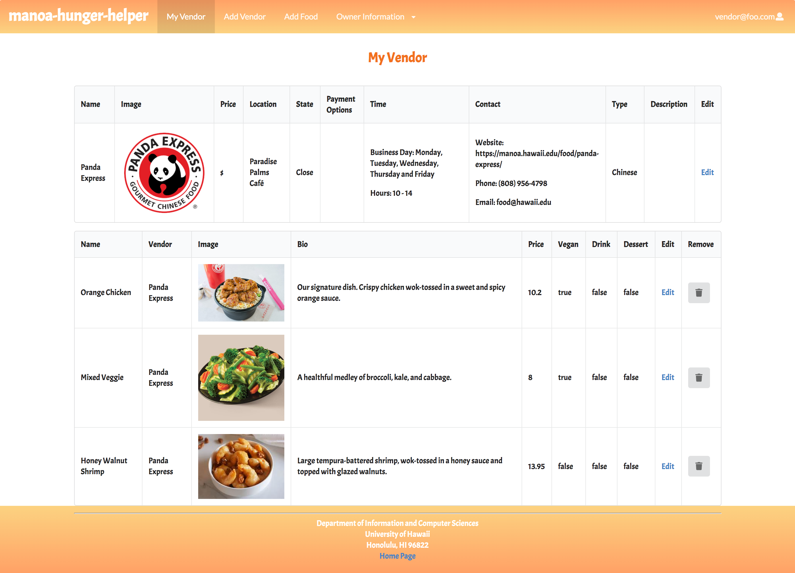

## Project Overview

Manoa Hunger Helper is an accessible application that helps students and faculty find all available vendors and food options on the campus. They can easily find food with the specified types and see the most recommended dish on the page. Users are also accessible to the detailed information of the vendor, including location, contact, and business hour. Additionally, vendors themselves can log in to their accounts to modify their restaurants’ information and freely edit their food menu.  Whether you are a user or a vendor, this application can help you out with a better dining serving. 

Visit project homepage: <a href="https://manoa-hunger-helper.github.io/"><i class="large github icon"></i>Manoa-Hunger-Helper HomePage</a>

Source code: <a href="https://github.com/manoa-hunger-helper/manoa-hunger-helper">github/Manoa-Hunger-Helper</a>

## Procedure

We implement Issue Driven Project Management in our Manoa-Hunger-Eat project. The overall project was divided into three milestones managed using a GitHub Project Board, with each of them containing a bunch of issues. Each teammate was equally assigned to some issues to work on. For Milestone 1, we brainstormed and created mockup pages for our project. The main task of this milestone was to build the structure of the three main roles- user, vendor and admin. This included the first version of the homepages, menu bars and footer. Moving to Milestone 2, we focused on the establishment of the default database. With the initial database we could be able to write the card and form components to display the data in a nice-look way. This process took the most time since the interaction with the database was the most challenging part of the project as well as the crucial part to achieve the functionality of this application. Milestone 3 was a final wrap up, including adding more real data, cleaning-up used code from the template, testing,  and collecting community feedback. Each team member performed skills gained from this course in completing the task on time, and communication was also encouraged, as solving problems independently sometimes could be less efficient than discussing with others. 

Visit project board: <a href=https://github.com/manoa-hunger-helper/manoa-hunger-helper/projects">Manoa-Hunger-Helper Project Board</a>

## My Contribution 

In regard to the user-interface, I mainly contributed to creating the mockups version of our project and initially setting up the homepage at the beginning. I was responsible for crafting the basic functionality of the user-related pages, which included creating collections for menu items, designing filter menus and recommended menus as well as the way to display menu items.  Thanks Su, Fei, and Jessica for working on the other parts of the project. Each of them was able to work individually and respond to others’ problems timely. Being in this pandemic period made things harder than usual but it was truly an awesome experience for me working as a team with them. 

## What I learned

Unlike the practice WODs, working on the final project was the first time I tried to figure a solution to a problem on my own, without step-by-step introduction or solution videos. It was very rewarding and satisfying when I finally got something  worked correctly, especially when it took hours and plenty of attempts to figure it out. It was interesting to turn a mockup version into a real version. I got more practice on coding with JS, JSX, HTML and CSS and understood how databases worked behind an application. It was much more complex than I thought it would be to achieve some functionalities that probably sound simple and common. I also developed some useful debugging skills. For example, using a typeof function to determine the specific type of return values can be helpful in solving some unclear console errors. The other thing I learned was that the sequences and priority of writing the sub pieces of the overall project need to be considered carefully. For instance, when my teammates already initialized the default data of vendors and used that data in many vendor-related pages. It would create a lot of extra work if I found I need to modify the database and use it in user-related pages, along with modifying the completed vendor-related pages. Therefore, an advanced consideration before starting is always significant and even more significant than the actual coding. 

