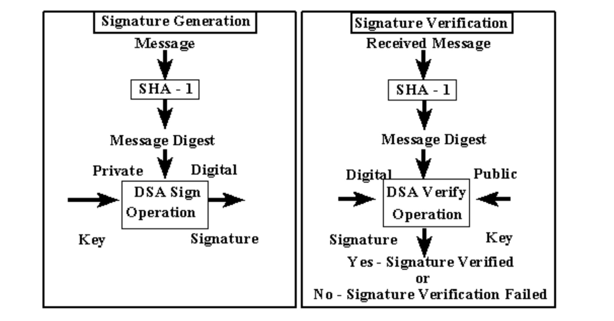

SHA-1 stands for Secure Hashing Algorithm. Its name gives away its purpose – it’s for cryptographic security. It is a mathematical function that condenses data to a fixed size. When we input a message or a string of any length within 264bits, the SHA-1 produces a 160-bit output known as a message digest. In the past years, SHA-1 was used in electronic mail, electronic fund transfer, data storage, digital signature, and so on. Hashing is referred to as one-way encryption, since the results are irreversible and unique. You couldn’t either use the result to figure out what the original piece of data was or have two different pieces of data produce the same result. Despite its replacement for today, it is still an amazing algorithm that CS students should know. The project requires us to achieve this algorithm using C or C++.  

To successfully build the correct algorithm, I am supposed to be familiar with the conversion of binary numbers to hexadecimal numbers. Once the representation of inputs is generated correctly, I could move toward writing functions that perform functionalities such as shifting, processing blocks and looping.  

The specific introduction of how to build this project was provided, and each step was clearly stated. However, I sort of had a hard time completing it. I spent a lot of time debugging my program, as I didn’t do the debugging until the overall program is roughly done. When I lastly searched for the errors, It came to me that I should have constantly checked the correctness of each step. Finding errors in such a relatively big program is challenging, and a good programmer should not expect to figure out all of the bugs in a big program in one time. 

Source: <a href="https://github.com/yongxinyang/SHA-1"><i class="large github icon "></i>github/SHA-1</a>

