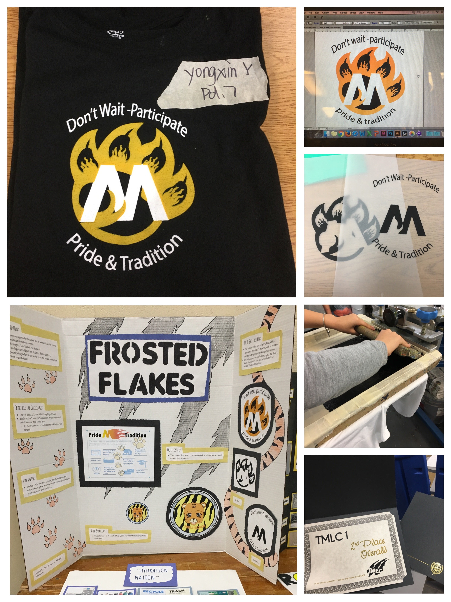

  

This was a final project for my high school media learning center showcase night. What I needed to achieve with my group mates was to design our group shirt, with respect to the school spirit  “ tradition and pride”. Posters, personal stickers, and presentations were created to supplemented to enrich our project showcase.  

In this project, I learned how to apply t-shirt screen printing. Beginning with designing the logo, which should appropriately represent the school symbol as well as the theme. My contribution was mainly to create this logo using Adobe Illustrator. I took a tiger paw as the outline,  integrating the fire element. The most important step was screen printing, which required a group collaboration. 
Screen printing is the process of transferring a stenciled design onto a flat surface using a mesh screen, ink, and a squeegee. First of all, we separated the artwork into its two color components, and printed them out onto a transparent acetate film. Bringing it to a dark room, we coated the prepared mesh screen with a light-sensitive emulsion. After the screen has been exposed for a set time, the areas of the screen not covered by the design will have turned hard. We used water to rinse off the unhardened emulsion so that the design would be revealed on the screen. Having all of these preparations done, we could move on to the printing process. Each screen was locked into the press and aligned to the pallet, which would hold the shirt to be printed. The ink was added to the top end of the screen, and a squeegee is used to pull the ink along the full length of the stencil, covering the open areas. The printer must use his skills to apply different pushes to ensure the design was imprinted on the product underneath. To create multi-coloured products, the shirt should be flash dried before the application of the next color, and it was crucial to line them up perfectly to ensure the final design is seamless. 

This was an interesting experience with product design and visual design. Our artwork was later selected as the represented logo of the class, and also my group won second place at the showcase night. This project built my interest in exploring the design field of computer science.

