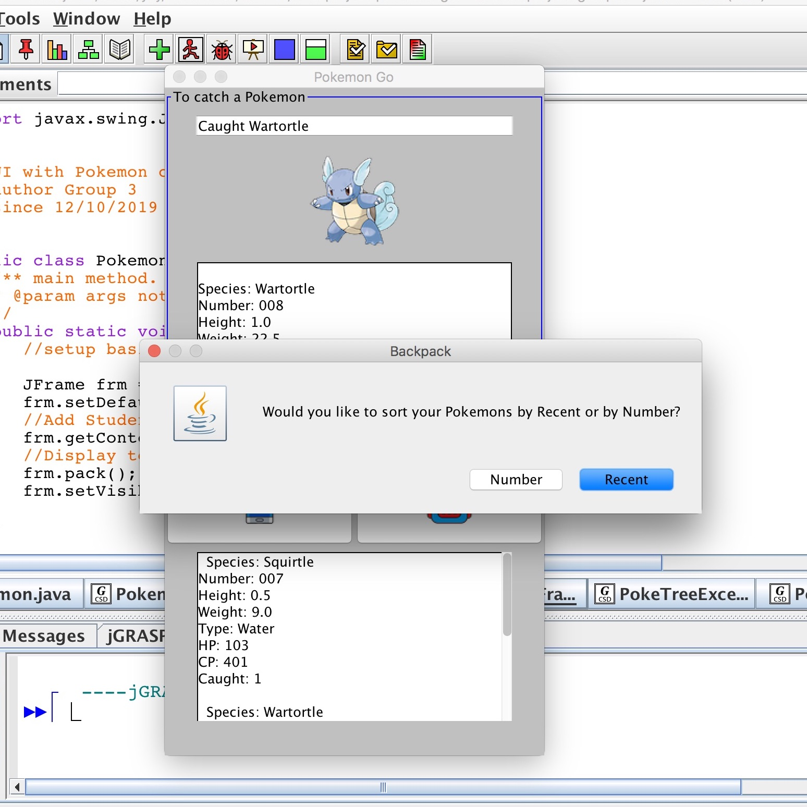

I created this simple catch-and-sort pokemon game by implementing Java Graphical User Interface, which was assigned as the final project of ICS 211. When the hunt button is clicked, a wild pokemon will appear on the screen, with its specific information displayed. Whether or not the Pokemon actually gets caught is randomly decided. The “backpack” button and “pokedex” buttons will display the list of captured Pokemon in various ways. To sort the Pokemons that have been caught in the “number” order, I used priority queue; to sort them in the “recent” order, I implemented stack. 

This is a comprehensive project, packaging what I have l worked on from the previous assignments together and performing a branch of tasks. It should originally be a group project, though I complete it solely on my own. There are dozens of functionalities of GUI that I have not learned and used in this assignment, but I end up realizing that a real comprehensive project is made up of thousands of fragments. In this simple game, I have acquired the knowledge of tree, stack, priority queue, user interface and learned how to combine them. In this project, the achievement of a simple function needs multiple Java features.  In real life, the creation of a huge project, such as an application, a video game, or a webpage, requires a group of programmers to maintain their parts well. I believe seeing those small pieces work as a whole must be exercising and will bring up a sense of satisfaction and success. 
 
Source: <a href="https://github.com/ICSatKCC/final-project-pokemon-gui-f19-final-project-group-3/tree/develop"><i class="large github icon"></i>github/Pokemon-game</a>
